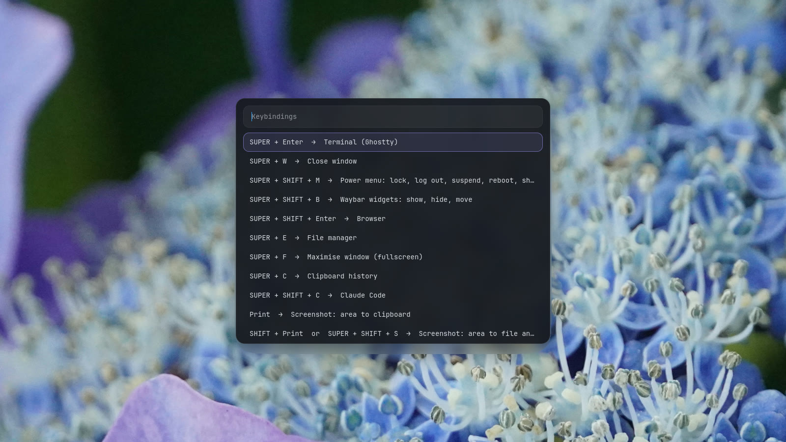
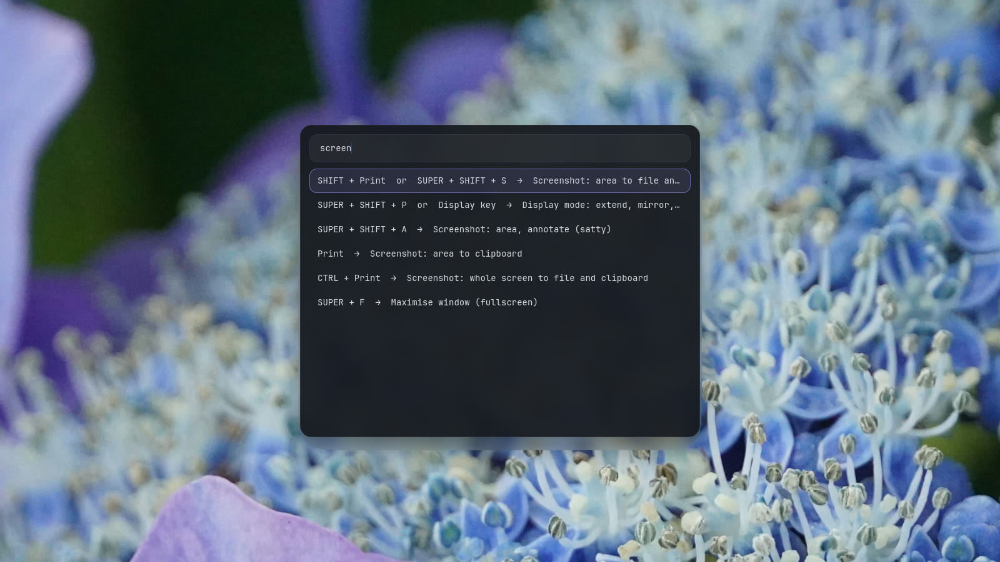
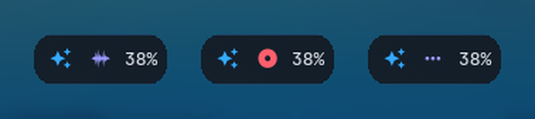
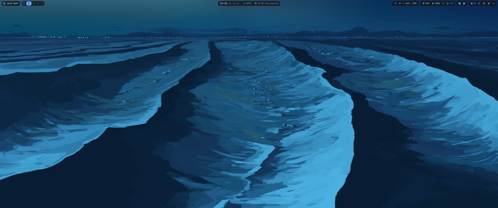
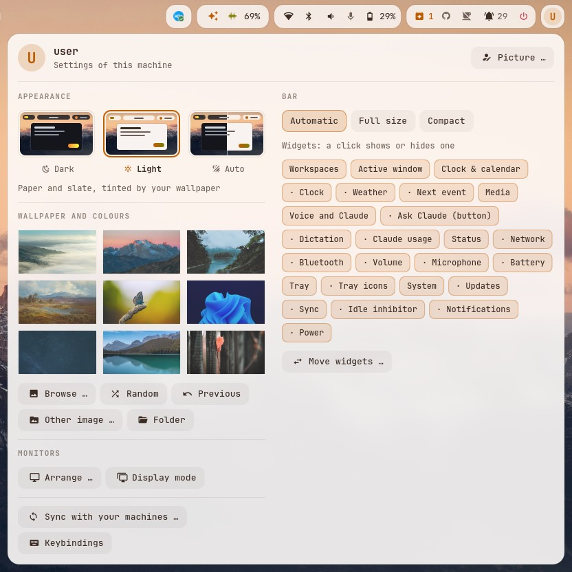
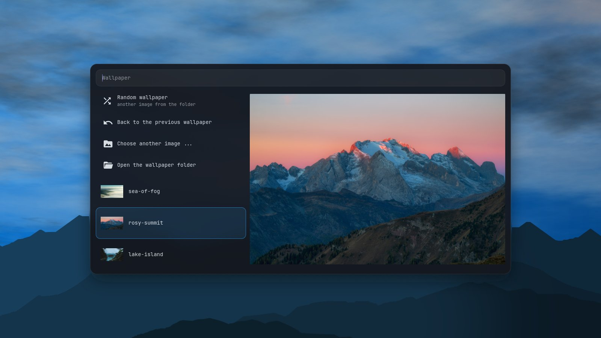
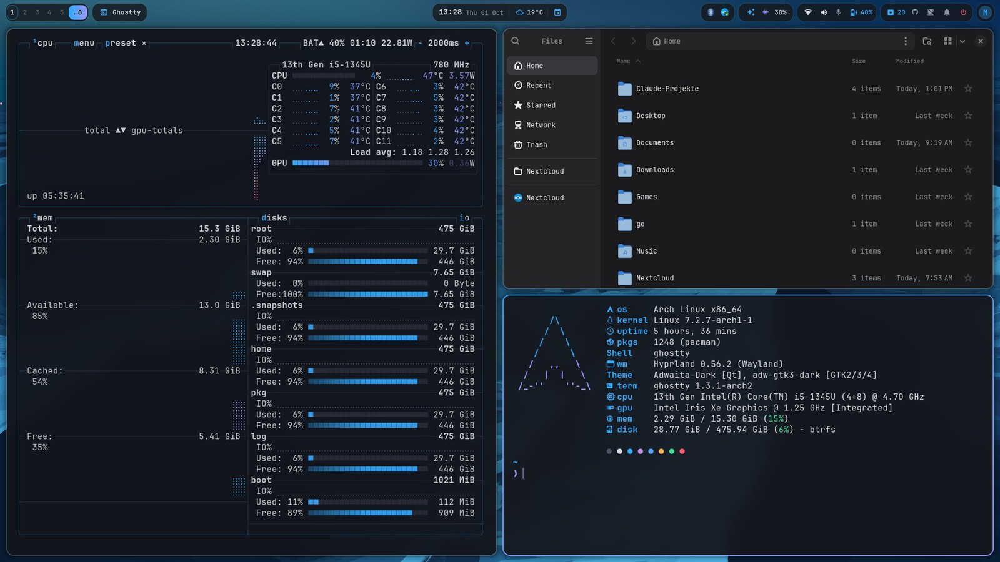
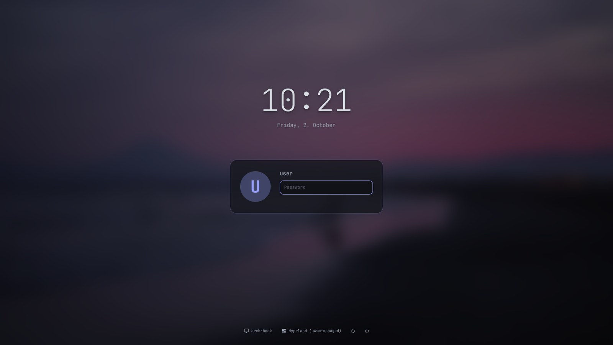

# Features

Everything driftless sets up, in one page. `SUPER + SHIFT + K` lists every key on the running desktop,
searchable as you type.

## Keys you'll use every day

| Keys | What |
|---|---|
| `SUPER + SPACE` | App launcher: apps, calculator, web search |
| `SUPER + RETURN` / `SUPER + SHIFT + RETURN` | Terminal / browser |
| `SUPER + D` | Dictation into the active window (tap: start/stop, hold: push-to-talk) |
| `SUPER + C` | Clipboard history |
| `SUPER + .` | Emoji picker |
| `SUPER + SHIFT + S` · `SUPER + SHIFT + A` | Screenshot of an area · the same, to annotate |
| `SUPER + K` | Colour picker (hex code to the clipboard) |
| `SUPER + SHIFT + P` | Display mode: extend, mirror, one screen (like Win + P) |
| `SUPER + SHIFT + M` | Lock, log out, suspend, reboot, shut down |
| `SUPER + SHIFT + K` | Every keybinding, searchable |

<table>
<tr>
<td width="50%"> <code>SUPER + SHIFT + K</code>: every key of the running desktop.</td>
<td width="50%"> Type to filter: <code>screen</code> leaves the screenshot, display and fullscreen keys.</td>
</tr>
</table>

## Dictation

Speak, and the text lands in whatever window is active, terminals included. All of it runs locally on
the GPU (Vulkan: AMD, Intel and NVIDIA):

- **whisper.cpp** (large-v3-turbo) transcribes, a voice detector keeps it from inventing text in silence
- **a small LLM** (`gemma3:4b` via Ollama) tidies up: fillers out, punctuation in, "Tuesday, no, I
  mean Wednesday" becomes "Wednesday". Spoken "comma", "new line", "new paragraph" work too
- about 1-2 seconds from letting go to the text; `SUPER + SHIFT + D` skips the LLM
- the model leaves VRAM after 5 minutes, so games get it back
- language, models and names Whisper should know: `DICTATE_*` in `personal/config`

 
The pill next to the microphone: ready, recording, transcribing. Click: start/stop, right click: without the LLM, middle: cancel.

## The bar

One Waybar per monitor: compact on notebook panels, spacious everywhere else. Pills from left to right:

 
The spacious bar on a 3440x1440 ultrawide.

- **You**: avatar and name; a click opens the settings menu
- **Workspaces** and the **active window**
- **Clock, weather and your next calendar event** (khal); a click opens the calendar
- **Media**: play/pause, skip, the title that is playing
- **Claude Code usage**: session and weekly limits, reset times in the tooltip
- **Status**: network, volume (click: next output), microphone, dictation, battery
- **System**: tray, pending updates, the sync, idle inhibitor, notifications (click: do not disturb),
  power

## Settings menu

A click on the avatar, every choice per machine:

 
The settings menu.

- **Widgets**: show, hide and move every pill, separately for the spacious and the compact bar
- **Bar size**: automatic, always spacious, always compact
- **Wallpaper and colours**: thumbnails and a large preview (next section)
- **Monitors**: arrange them (nwg-displays), or back to the automatic layout
- **Sync**: mode, what is waiting, trust a new machine
- **Keybindings**: the searchable list

## Theme from the wallpaper

`set-wallpaper IMAGE` derives two accent colours from the image and renders them into Waybar, walker,
wlogout, mako, Ghostty, hyprlock, the login screen, GTK, Qt, btop and VS Code (theme "driftless": 2026
Dark with your accents). The calendar, fastfetch, bat and fzf use the terminal's accent slots, so they
follow too.

- **The wallpaper menu** (settings menu): your wallpaper folder with thumbnails and a large preview,
  plus a random one, the previous one or any other image. The folder is `WALLPAPER_DIR` in
  `personal/config`, e.g. one your cloud client syncs, so every machine has the same choice
- **The change itself** (awww): the new image grows in as a circle from the mouse pointer while the
  colours change with it
- **A new wallpaper every day**, at random from the folder; a day the machine was off catches up after
  the next login. `set-wallpaper --random` does the same by hand
- **The login screen** (ReGreet) shows the same wallpaper, your avatar and the machine's name, and
  follows every change without a password prompt

 
The wallpaper menu: thumbnails, and the selected image large.

<table>
<tr>
<td width="50%"> The terminal palette follows the wallpaper.</td>
<td width="50%"> The login screen with the same wallpaper and colours.</td>
</tr>
</table>

## Gaming

Steam, Proton-GE, Lutris, gamescope and gamemode, with tearing allowed for games (lower input
latency) and rules that open stubborn games fullscreen on the right monitor.

## The system underneath

- **btrfs with snapper** snapshots, optional **LUKS2** encryption (TPM unlock: [docs/encryption.md](docs/encryption.md))
- **unified kernel images**, with an LTS kernel as fallback ([docs/boot.md](docs/boot.md))
- zram, a firewall (ufw), SMART warnings as desktop notifications, locked screen after 10 minutes
- the session runs under uwsm: bar, notifications, idle, clipboard and wallpaper are systemd user units
  that restart when they crash

## Keeping your machines in step

- your home is **links into the repository**: editing `~/.config/hypr/hyprland.lua` is editing the
  repository
- an **hourly sync** commits what you changed and takes over what your other machines changed, but only
  commits one of your machines signed; it refuses anything that looks like a password
- **package lists** you write (`driftless packages add NAME GROUP`), picked per machine by its hardware
- what differs per machine goes into `hosts/<host>/`, what is yours into `personal/`
- `driftless verify` shows where a machine differs from the repository; a new machine is two scripts
  away ([README](README.md#install-a-new-machine))
