# Features

Everything driftless sets up, in one page. `SUPER + SHIFT + K` lists every key on the running desktop,
searchable as you type.

## Keys you'll use every day

| Keys | What |
|---|---|
| `SUPER + SPACE` | App launcher: apps, calculator, web search |
| `SUPER + RETURN` / `SUPER + SHIFT + RETURN` | Terminal / browser |
| `SUPER + D` | Dictation into the active window (tap: start/stop, hold: push-to-talk) |
| `SUPER + A` | Ask Claude by voice: the answer appears at the top and is spoken (tap or hold, like dictation) |
| `SUPER + C` | Clipboard history |
| `SUPER + .` | Emoji picker |
| `SUPER + SHIFT + S` · `SUPER + SHIFT + A` | Screenshot of an area · the same, to annotate |
| `SUPER + K` | Colour picker (hex code to the clipboard) |
| `SUPER + SHIFT + P` | Display mode: extend, mirror, one screen (like Win + P) |
| `SUPER + L` | Lock the screen |
| `SUPER + SHIFT + M` | Power menu: lock, log out, suspend, reboot, shut down |
| `SUPER + N` · `SUPER + SHIFT + N` | The notifications · do not disturb on/off |
| `SUPER + SHIFT + K` | Every keybinding, searchable |

<table>
<tr>
<td width="50%"> <code>SUPER + SHIFT + K</code>: every key of the running desktop.</td>
<td width="50%"> Type to filter: <code>screen</code> leaves the screenshot, display and fullscreen keys.</td>
</tr>
</table>

## Dictation

Speak, and the text lands in whatever window is active, terminals included. All of it runs locally on
the GPU (Vulkan: AMD, Intel and NVIDIA):

- **whisper.cpp** (large-v3-turbo) transcribes, a voice detector keeps it from inventing text in silence
- **a small LLM** (`gemma3:4b` via Ollama) tidies up: fillers out, punctuation in, "Tuesday, no, I
  mean Wednesday" becomes "Wednesday". Spoken "comma", "new line", "new paragraph" work too
- about 1-2 seconds from letting go to the text; `SUPER + SHIFT + D` skips the LLM
- the model leaves VRAM after 5 minutes, so games get it back
- language, models and names Whisper should know: `DICTATE_*` in `personal/config`

 
The dictation icon in the bar: ready, recording, transcribing. Click: start/stop, right click: without the LLM, middle: cancel.

## Asking Claude

`SUPER + A`, a question, and the answer appears in a bubble at the top of the screen while a voice
reads it out. Like Siri or Alexa, for the quick things, without opening a window:

<table>
<tr>
<td width="50%">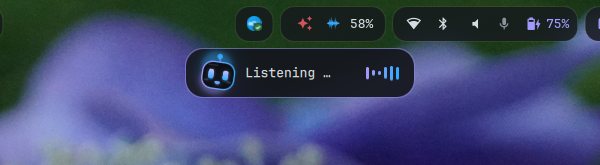 Listening: the little bot and the bars follow your voice.</td>
<td width="50%">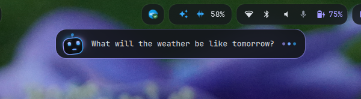 Your question while Claude works on it.</td>
</tr>
<tr>
<td width="50%">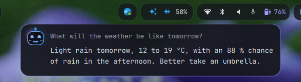 The answer, typed in as it arrives and read out at the same time.</td>
<td width="50%">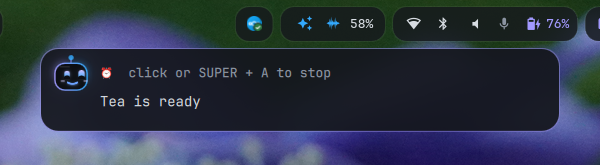 A timer rings until you stop it.</td>
</tr>
</table>

| Say | What happens |
|---|---|
| "Set a timer for 10 minutes for the pasta", "Remind me at 3 to call Anna" | a gentle marimba alarm that swells until a click or `SUPER + A` stops it, and the voice says what it was for; "Which timers are running?", "Cancel the timer" |
| "Do I have anything on this afternoon?", "Put the dentist in for Tuesday at 3" | reads and adds calendar events (khal, synced right away) |
| "What will the weather be like tomorrow?" | now and three days, for your `WTTR_LOCATION` or any place |
| "What's on my screen?", "Summarise this article", "What does this error mean?" | Claude looks at a screenshot of your monitor |
| "Translate what I copied", "Write a polite reply that I'm ill and paste it" | reads the clipboard, types text into the active window |
| "Note: buy milk", "What did I note?" | a notes file (`NOTCH_NOTES`, default `~/Documents/notes.md`) |
| "Pause the music", "Next song", "Volume to 30", "Brighter" | media, volume, screen brightness |
| "How full is the battery?", "Are there updates?", "Connect my headphones" | battery, disk, memory, network, pending updates, Bluetooth |
| "Do not disturb", "Lock the screen", "New wallpaper", "Suspend" | |
| "Open Firefox", "Find my tax return", "Open the Arch Wiki on PipeWire" | starts apps, finds files by name, opens files and pages |
| "What's 18 % of 240?", "How do you say thank you in Japanese?", news, facts | answered directly or from a web search |

A question within two minutes continues the conversation ("And on Friday?"). A click on the bubble or
a new question stops everything.

Whisper transcribes locally (the dictation setup), Claude Code answers (`claude -p`, Haiku by default)
and may use only `notch/tools.py` (the actions above), the screenshot and web search, without asking
and without your Claude Code settings. Piper speaks the answer sentence by sentence as it arrives,
locally too (installed into a venv on first use). The bubble is part of the desktop shell, in the colours
of your wallpaper (it follows a new one at once): listening with level bars, thinking, then it opens up
for the answer. Model, language, voice and notes file:
`NOTCH_*` in `personal/config`.

## The bar

One bar per monitor, drawn by Quickshell together with its popups and the Claude bubble: compact on
notebook panels, spacious everywhere else. It follows the wallpaper's colours and your widget layout
live, without a restart. Pills from left to right:

 
The spacious bar on a 3440x1440 ultrawide.

- **You**: avatar and name; a click opens the settings (next sections)
- **Workspaces** (the active one's gradient slides along) and the **active window**
- **Clock, weather and your next calendar event**. Click the clock: the month with a dot on every day
  that has events, click a day for its events, and what comes up; right click or a click on the event:
  ikhal. Click the weather: the next hours and three days
- **Media**: play/pause, skip, the title slides through when it is long. Click it: cover, progress (click
  to jump), shuffle and repeat, and every player that runs
- **Voice and Claude**: the ✨ button asks Claude by voice (click: talk, click again: send; the bubble
  grows out of it), dictation next to it, then Claude's session and weekly limits; click them: both
  with their resets and the tokens per day
- **Status**: network (click: Wi-Fi networks, join a known one, on/off), Bluetooth (click: your devices
  with their battery, and the ones nearby to pair with one click; right: on/off), volume (wheel: level;
  click: outputs, microphones and a level per app that plays; right: mute), microphone, battery (click:
  time left, power draw, health, power profile)
- **Tray**: the apps' own icons (right click: the app's menu in the same style)
- **System**: pending updates, the sync, keep awake, notifications (click: the list; right: do not
  disturb; middle: clear all), power (click: the power menu; right: lock)

Hover anything for a tooltip; a click elsewhere or `Esc` closes a popup. Popups also open from a key
binding or a script: `quickshell ipc -p ~/.config/quickshell call bar popup calendar` (`weather`,
`media`, `claude`, `audio`, `network`, `bluetooth`, `battery`, `notifications`, `settings`).

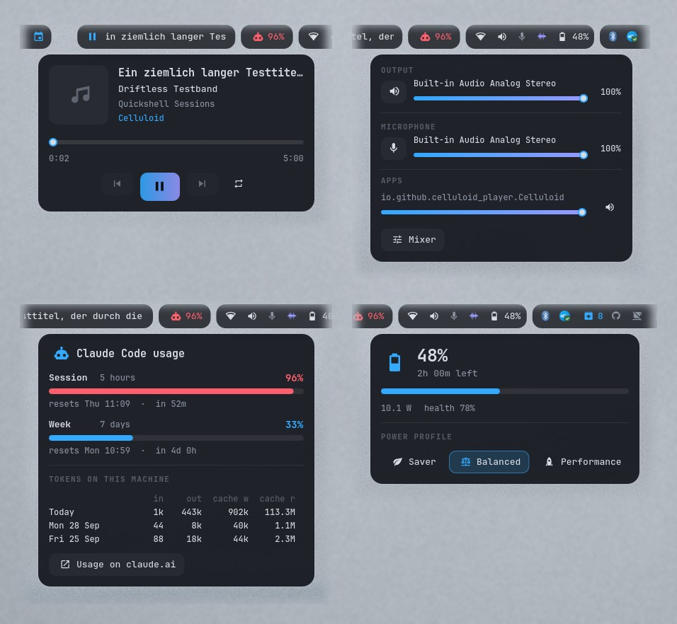 
Popups: what plays, sound with a level per app, Claude usage, battery and power profile.

## Notifications, lock screen, power menu and password dialog

The same shell draws everything around the bar, in the same cards, colours and motion, so nothing on
the desktop looks borrowed from another program.

- **Notifications** pop up at the top right of the screen you work on, below the bar: the app's icon
  or the picture it sent, the text, a progress bar when it sends one, its buttons, and a thin line
  that runs out (it waits while the pointer is on the card). Click: the app's action or its window ·
  right click, `×` or a swipe: away. A notification that replaces another one (a download, the
  calendar sync) updates the card in place
- **The list** (the bell, `SUPER + N`): everything still there, grouped by app, with **do not disturb**
  (`SUPER + SHIFT + N`, or a right click on the bell: only critical ones pop up) and "clear". The bell
  glows while there is something you have not seen. The list outlives a restart and a new login (seven
  days, in `~/.local/state/driftless-shell` on this machine only, readable only by you); kept ones come
  back without their buttons
- **Quiet in fullscreen**: while the workspace you look at has a fullscreen window (a game, a video),
  only critical notifications pop up; afterwards one card says how many came in meanwhile (click: the
  list)
- **On-screen display**: volume, mute, the microphone, a new output device (headphones plugged in) and
  the brightness keys show a small pill at the bottom, from the keys, the bar or anywhere else
- **Lock screen** (`SUPER + L`, after 10 minutes, before sleep): the login screen's look, so locking
  and logging in feel like one thing: the blurred wallpaper, the clock, your picture and the password.
  It only counts what came in meanwhile, the cards come when you are back. hyprlock stays as the
  fallback when the shell does not answer, and a shell that crashes while locked takes the lock over
  again after its restart: the screen never opens by itself
- **Power menu** (`SUPER + SHIFT + M`, the power button): lock, log out, suspend, reboot, shut down,
  with the arrows and Enter or the letter on a card. Suspend locks first
- **Password dialog**: when a program asks for more rights (driftless installing packages, a mount, an
  app's settings), the lock screen's card asks for your password over the dimmed screen, with what is
  asked and the polkit action it is for. The shell is the session's polkit agent. Note: polkit counts a
  cancelled request like a wrong password, and three in a row lock `sudo` and polkit for ten minutes
  (Arch's `pam_faillock`)

<table>
<tr>
<td width="50%">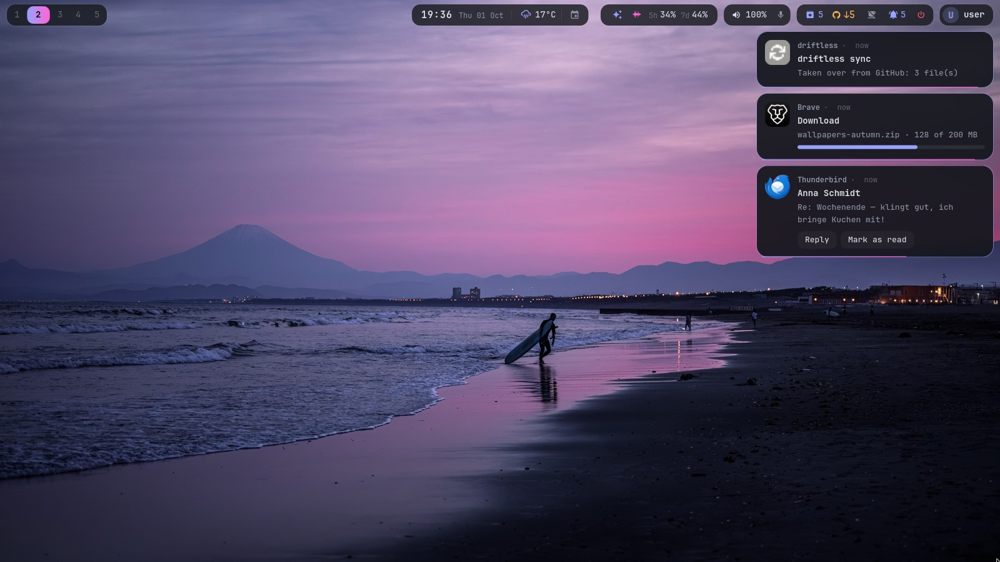 Notifications below the bar.</td>
<td width="50%">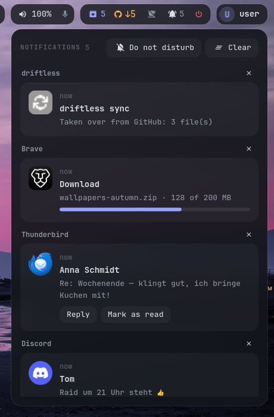 The bell's list, grouped by app.</td>
</tr>
<tr>
<td>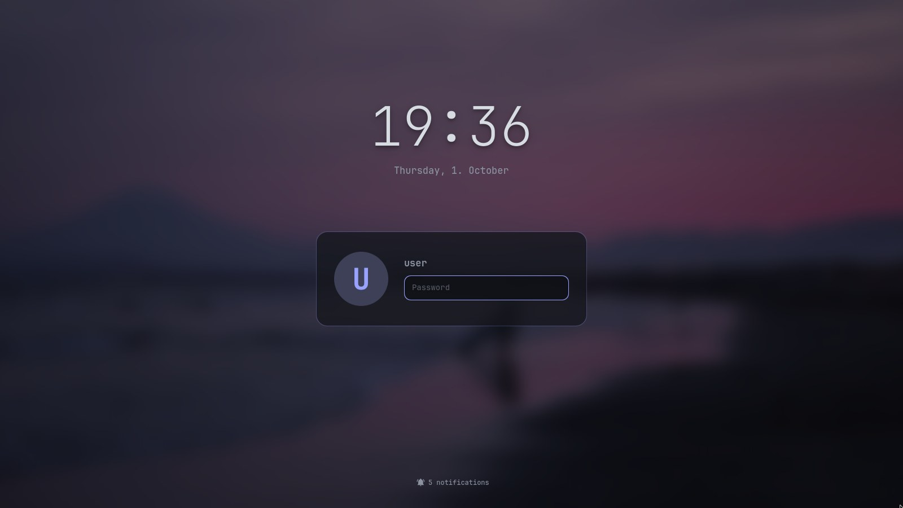 The lock screen, like the login screen.</td>
<td>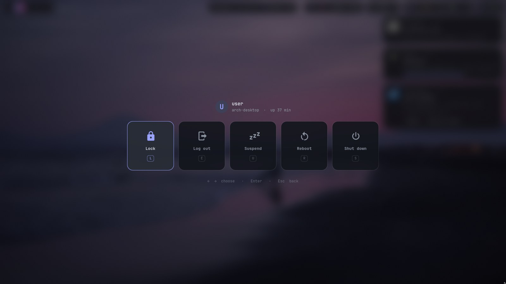 The power menu.</td>
</tr>
</table>

<table>
<tr>
<td width="50%">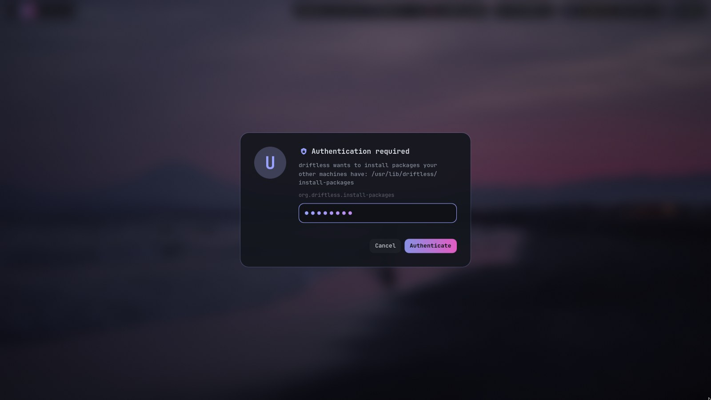 The password dialog.</td>
<td width="50%">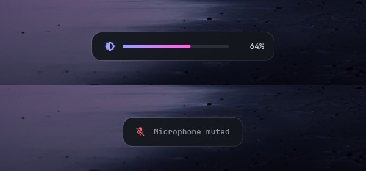 The on-screen display.</td>
</tr>
</table>

## Settings menu

A click on the avatar opens them as a popup of the bar, every choice per machine:

 
The settings popup.

- **Wallpaper and colours**: the newest images of your folder as thumbnails (click: that one), random,
  the previous one, any other image, the folder; "Browse" opens the whole folder with a large preview
- **Bar size**: automatic, always full size, always compact
- **Widgets**: a click shows or hides one, the bar follows at once; "Move widgets" orders them,
  separately for the spacious and the compact bar
- **Monitors**: arrange them (nwg-displays), the display mode on a notebook, back to the automatic layout
- **Sync**: mode, what is waiting, trust a new machine
- **Keybindings**: the searchable list

## Theme from the wallpaper

`set-wallpaper IMAGE` derives two accent colours from the image and renders them into the shell (bar,
notifications, lock screen, power menu), walker, Ghostty, the login screen, GTK, Qt, btop and VS Code
(theme "driftless": 2026 Dark with your accents). The calendar, fastfetch, bat and fzf use the terminal's accent slots, so they
follow too.

- **The wallpaper menu** (settings popup, "Browse"): your wallpaper folder with thumbnails and a large preview,
  plus a random one, the previous one or any other image. The folder is `WALLPAPER_DIR` in
  `personal/config`, e.g. one your cloud client syncs, so every machine has the same choice
- **The change itself** (awww): the new image grows in as a circle from the mouse pointer while the
  colours change with it
- **A new wallpaper every day**, at random from the folder; a day the machine was off catches up after
  the next login. `set-wallpaper --random` does the same by hand
- **The login screen** (ReGreet) shows the same wallpaper, your avatar and the machine's name, and
  follows every change without a password prompt; the lock screen uses the same image

 
The wallpaper menu: thumbnails, and the selected image large.

<table>
<tr>
<td width="50%"> The terminal palette follows the wallpaper.</td>
<td width="50%"> The login screen with the same wallpaper and colours.</td>
</tr>
</table>

## Gaming

Steam, Proton-GE, Lutris, gamescope and gamemode, with tearing allowed for games (lower input
latency) and rules that open stubborn games fullscreen on the right monitor.

## The system underneath

- **btrfs with snapper** snapshots, optional **LUKS2** encryption (TPM unlock: [docs/encryption.md](docs/encryption.md))
- **unified kernel images**, with an LTS kernel as fallback ([docs/boot.md](docs/boot.md))
- zram, a firewall (ufw), SMART warnings as desktop notifications, locked screen after 10 minutes
- the session runs under uwsm: the shell (bar, notifications, lock screen), idle, clipboard and
  wallpaper are systemd user units that restart when they crash

## Keeping your machines in step

- your home is **links into the repository**: editing `~/.config/hypr/hyprland.lua` is editing the
  repository
- an **hourly sync** commits what you changed and takes over what your other machines changed, but only
  commits one of your machines signed; it refuses anything that looks like a password
- **package lists** you write (`driftless packages add NAME GROUP`), picked per machine by its hardware
- what differs per machine goes into `hosts/<host>/`, what is yours into `personal/`
- `driftless verify` shows where a machine differs from the repository; a new machine is two scripts
  away ([README](README.md#install-a-new-machine))
