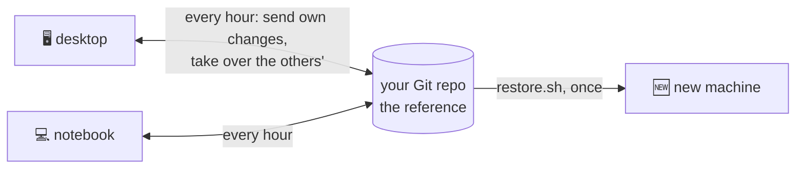
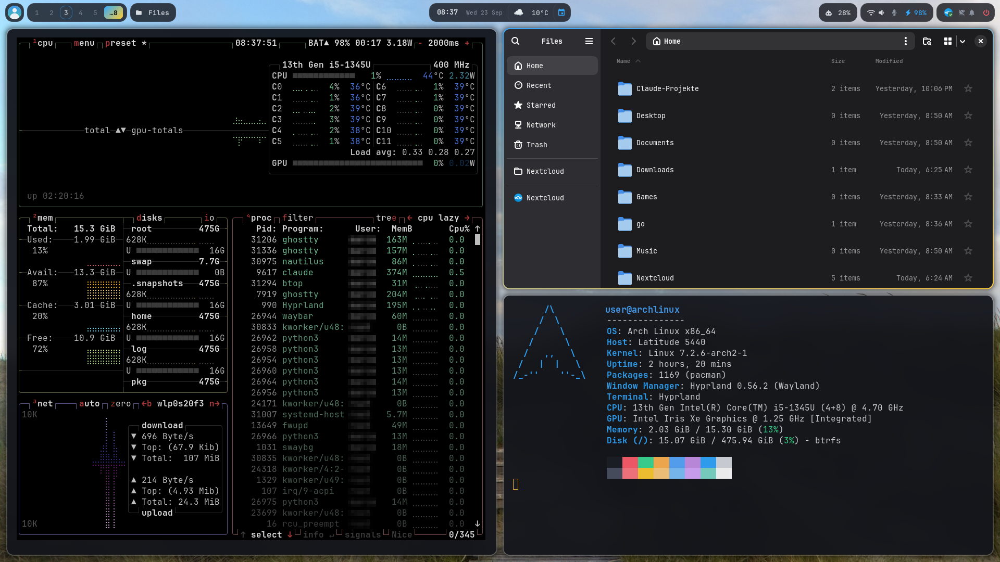
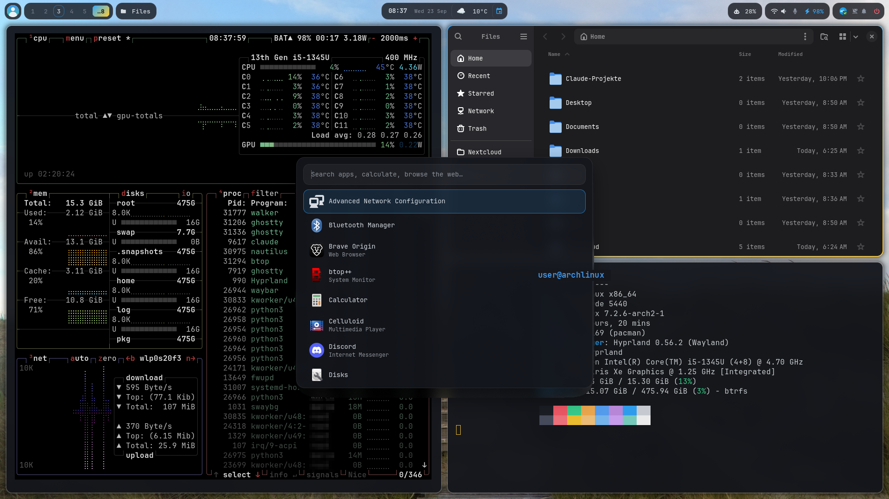
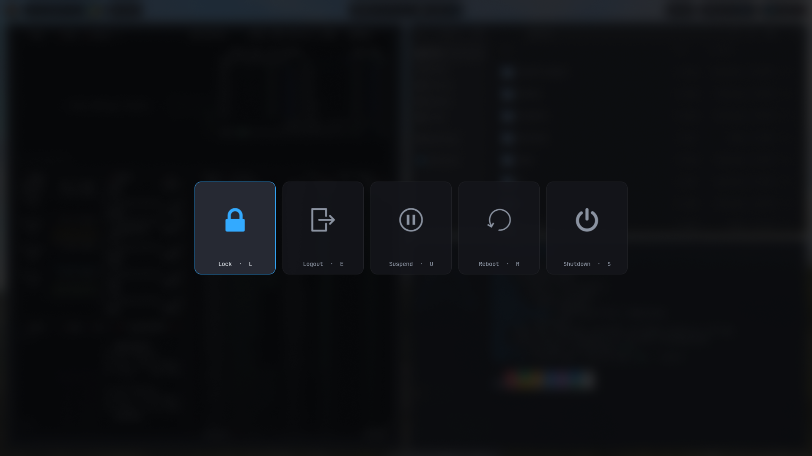
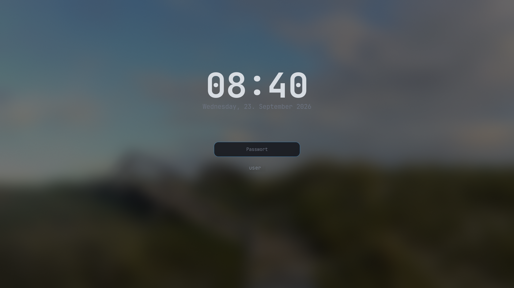

# 🏔️ Arch Hyprland Kit

**Set up one machine, and every other one follows.**

A complete Arch Linux desktop (Hyprland, Waybar, a gaming stack, and a theme generated from your wallpaper) that installs with one command and then keeps all your machines identical. Change a config or install a program on one of them, and within an hour every other machine has it too. The sync runs through your own Git repository.



<table>
<tr>
<td width="50%"><br><sub><b>Desktop</b>, 3440x1440 ultrawide: the spacious Waybar.</sub></td>
<td width="50%"><br><sub><b>Notebook</b>, 1920x1080: the same setup, and the bar switches to compact on its own (<a href="#-waybar-adapts-to-the-screen">how</a>).</sub></td>
</tr>
</table>

## 🧭 What It Does

1. **Records changes.** Every hour, each machine records what changed on it: configs (Hyprland, Waybar, theme …), settings, newly installed programs and VS Code extensions. All of it goes to your repo.
2. **Spreads them.** The other machines take over what arrives: files are copied, deleted files deleted, and running programs reloaded.
3. **Installs what is missing.** A program installed on one machine is installed on the others too. Drivers and notebook extras stay on the hardware they belong to.
4. **Builds new machines.** On a fresh Arch install, `restore.sh` sets up everything in one go: packages, configs, theme, login screen and hardware detection. From then on the machine takes part in the sync.

It stays safe because:

- **The repo wins** when two machines contradict each other.
- **Nothing is uninstalled and nothing is upgraded** automatically; that stays your call.
- **Machine-specific things stay per machine**: hostname, hardware packages, pinned monitor modes.
- **Every change can be undone**: git keeps the full history.

## 🧩 Make It Yours

This repo is a template. Your machines push their state every hour, so they need **their own repository, and it should be private** (it will hold your configs and package lists).

1. On GitHub: **Use this template → Create a new repository → Private**.
2. Clone it to `~/rebuild` on your first machine (the sync timer expects that path).
3. Adjust what is personal, before or after the first install:

| What | Where |
|---|---|
| Keyboard layout | `kb_layout` in `files/home/.config/hypr/hyprland.lua`; console: `install-base.sh --keymap` |
| Timezone, hostname, user | `install-base.sh --tz … --hostname … [user]` |
| Wallpaper and colours | `set-wallpaper /path/to/image` (the whole theme follows) |
| Weather location | automatic from your IP; fixed: `WTTR_LOCATION` in the environment |
| Name in the bar | your account's full name (`sudo chfn -f "Your Name" $USER`) |
| Avatar | `files/home/.config/waybar/avatar.png`, `files/etc/greetd/avatar.png` |
| Programs | `packages/pacman.txt`, `packages/aur.txt` (or just install/uninstall; the sync records it) |
| Calendar (optional) | `bash calendar-login.sh` asks for your Nextcloud address and login |
| Notes folder (optional) | `KIT_NOTES_REL` in `kit.conf` |

It is **opinionated**: it ships one person's app selection, including a gaming stack (Steam, Lutris for Battle.net/Diablo 4), a Waybar widget for Claude usage limits (`waybar/claude-usage.py`, reads Claude Code's login and an unofficial usage endpoint) and a Nextcloud calendar. Drop what you don't need from `packages/*.txt` and `waybar/config.jsonc`.

Then install as described in [Quick Start](#-quick-start). On every further machine, clone the same repo and run `restore.sh`; from then on they stay in step.

## Table of Contents
- [What It Does](#-what-it-does)
- [Make It Yours](#-make-it-yours)
- [Theme Gallery](#-theme-gallery)
- [Quick Start](#-quick-start)
- [Automatic Sync Between Machines](#-automatic-sync-between-machines)
- [Waybar Adapts to the Screen](#-waybar-adapts-to-the-screen)
- [Display Modes (SUPER + SHIFT + P)](#-display-modes-super--shift--p)
- [Hardware Detection](#-hardware-detection-libhardwaresh)
- [What's in the Kit](#-whats-in-the-kit)
- [What `restore.sh` Also Creates](#-what-restoresh-also-creates-step-8b)
- [What's NOT in the Kit](#-whats-not-in-the-kit)
- [Tested Hardware](#-tested-hardware)

## 🎨 Theme Gallery

One palette for everything: `theme/apply.py` derives two accent colours from the wallpaper and renders them into Waybar, walker, wlogout, mako, Ghostty, hyprlock, ReGreet, GTK 3/4, Qt and the Hyprland borders. Everything sits on the same dark, translucent surface with rounded corners and JetBrainsMono Nerd Font. All shots are from the 1920x1080 notebook.

<table>
<tr>
<td width="50%"><br><sub><b>Tiling:</b> btop, Nautilus and Ghostty with fastfetch. The focused window gets the accent border, the terminal palette follows the wallpaper.</sub></td>
<td width="50%"><br><sub><b>walker</b> (<code>SUPER + SPACE</code>): apps, calculator and web search in one field. Also the menu for clipboard history, emoji and display modes.</sub></td>
</tr>
<tr>
<td><br><sub><b>wlogout</b> (<code>SUPER + SHIFT + M</code> or the power pill): five centred tiles over a blurred desktop, one-key shortcuts.</sub></td>
<td><br><sub><b>mako</b>: notifications top right, below the bar, in the same surface and accent border. The bell pill counts them and toggles do-not-disturb.</sub></td>
</tr>
<tr>
<td><br><sub><b>hyprlock</b>: blurred, dimmed wallpaper, big clock and a password field with the accent border (via hypridle or the lock tile).</sub></td>
<td><br><sub><b>ReGreet</b> in cage: the login screen with the wallpaper, avatar and the machine's hostname.</sub></td>
</tr>
</table>

## 🚀 Quick Start

| # | Step | Command |
|---|---|---|
| 1 | **Fresh install only** — Arch live ISO, **wipes the disk!** Partitions GPT + btrfs (`@`, `@home`, `@log`, `@pkg`, `@snapshots`), systemd-boot, creates the user. Without a disk argument it lists the drives and asks. Microcode is picked automatically from the detected CPU, always exactly one disk (no multi-disk pool). On the live ISO, clone your kit repo and run the script from the clone (`git clone https://github.com/<you>/<repo> /root/rebuild`; for a private repo, a personal access token is the password). Use a clone, not an unpacked zip: the sync needs the `.git` folder, and `restore.sh` only enables it for a clone. | `bash install-base.sh [/dev/DISK] [user] [--hostname NAME] [--keymap MAP] [--tz ZONE]` |
| 2 | Reboot, log in as your user, connect to the network (`nmtui`), then restore the kit. Safe to run more than once (idempotent). | `sudo bash ~/rebuild/restore.sh`<br>Options: `--no-aur`, `--no-snapshot`, `-u USER` |
| 3 | Reboot → graphical ReGreet login with wallpaper → Hyprland starts. | – |
| 4 | Set up the calendar (Nextcloud app password goes into the keyring, plus sync + timer). The password itself is deliberately **not** in the kit. | `bash ~/rebuild/calendar-login.sh` |

At the end, `restore.sh` automatically runs `verify.sh` — a read-only check of whether the system matches the kit (home ownership, packages, dotfiles, `/etc`, services, boot entries, user setup). Exit code = number of FAILs. Can also be run on its own at any time:

```bash
bash ~/rebuild/verify.sh
```

**An already installed machine joins the sync** with the repo cloned to `~/rebuild`. First it takes the GitHub state as a whole, then it allows the sync to install packages:

```bash
cd ~/rebuild && git fetch && git reset --hard origin/main && ./auto-snapshot.sh --adopt
sudo install -m440 lib/sudoers-rebuild-sync /etc/sudoers.d/10-rebuild-sync
systemctl --user enable --now rebuild-snapshot.timer
```

## 🔄 Automatic Sync Between Machines

Every machine runs the same user timer, `rebuild-snapshot.timer`: 3 minutes after login and then hourly. Each run of `auto-snapshot.sh` does four things in a fixed order:

1. **Snapshot.** `snapshot.sh` records this machine's changes in the kit (dotfiles, dconf, Claude notes, package lists, VS Code extensions, readable `/etc` files) and commits them as `Automatic snapshot <host> <time>`.
2. **Pull.** It merges `origin/main`. Where both machines changed the same lines, **GitHub wins** (`-X theirs`). If git still cannot merge, nothing is applied or pushed and a notification asks for a manual fix.
3. **Apply.** It copies every kit file the merge changed onto this machine (`files/home` → `~`, `files/dconf.ini` → `dconf load`, `files/CLAUDE.md` and `files/docs` → the notes folder set in `kit.conf`). Files deleted in the kit are deleted here. Hyprland, Waybar, mako and systemd are reloaded as needed. Packages and VS Code extensions from the lists that are missing here get installed.
4. **Push**, then refresh the zip copy set as `KIT_ZIP` in `kit.conf` (for example in a cloud folder), if the kit changed.

How the details work:

- **Package lists are shared.** A machine only adds what it installed and drops what it removed since its own last snapshot (`lib/lists.sh`, state in `~/.local/state/rebuild`). A package only one machine has therefore ends up on all of them. The sync **never uninstalls**: a package removed on one machine leaves the list, and the others keep it until you remove it there too. Hardware packages (microcode, GPU drivers, notebook extras) stay out of the lists (`lib/hardware.sh`).
- **Installing needs pacman without a password**, once per machine (`restore.sh` sets this up on new installs). Without it you only get a notification listing what is missing.
  ```bash
  sudo install -m440 ~/rebuild/lib/sudoers-rebuild-sync /etc/sudoers.d/10-rebuild-sync
  ```
  The sync does not upgrade the system. If a package cannot be installed (for example an outdated package database), you get one notification; run `sudo pacman -Syu`.
- **Whoever can push to the kit repo is root on every machine.** pacman without a password is effectively root, and the sync builds new AUR packages from the lists without showing their PKGBUILDs. Keep the repo private, protect the account (2FA), and give nobody else write access.
- **`/etc` files are recorded, not applied** (that would need root). A machine only writes one into the kit when the file changed there, so an older copy never overwrites a newer one. `/etc/hostname` differs per machine; the kit keeps its copy only as a fallback name for `restore.sh`.
- **A machine that fell behind** (for example off for weeks while the other one changed things by hand, or before its first sync run) should take the GitHub state as a whole first. Otherwise its first snapshot would push its old files back:
  ```bash
  ~/rebuild/auto-snapshot.sh --adopt
  ```
  This drops unpushed local commits and copies every kit file over the live one.

Run the sync by hand at any time, for example right after a bigger config change, and read its log:

```bash
systemctl --user start rebuild-snapshot.service
journalctl --user -u rebuild-snapshot.service -n 30
```

### 🎛️ Sync Pill in the Bar

The sync shares a pill with the package updates (`group/upkeep`; in the compact bar it sits in the system group). It shows the GitHub logo, set off from the updates by a thin divider; colour and a small mark give the state: dim when all is in step, `↓n` for commits on GitHub this machine has not taken over, `↑n` for local commits not pushed yet, yellow while something waits for review or the sync is off (with a pause mark), red with an alert mark after a merge conflict or a failed run. The tooltip says who wrote to GitHub last, what the incoming commits would change (files and, highlighted, **new packages**) and when every machine last sent a change.

| Mode | What the hourly run does |
|---|---|
| **automatic** (default) | all four steps, as above |
| **review first** | records and fetches, but while GitHub has something new it stops before the merge: nothing applied, nothing pushed, one notification. Look at the diff, then *Sync now* takes it over. |
| **off** | nothing at all |

Separately, **installs off** keeps the sync from installing any package or VS Code extension from the lists (configs are still applied). Click the pill for the menu (modes, installs, *Review incoming changes* as a full diff in a terminal, *Check GitHub now*, log, commits on GitHub); right-click syncs now, middle-click pauses or resumes. Terminal: `~/.config/waybar/sync-menu.sh now|toggle|auto|review|off|installs|check|diff|log|github`.

The switches are files in `~/.local/state/rebuild` (`mode`, `installs`) and never travel with the kit, so a bad state on GitHub cannot switch them back on. Every run writes its outcome to `status` there and refreshes the pill (signal 11); `sync.py` itself only reads local git refs, the network is used by the run or by *Check GitHub now*.

## 🖥️ Waybar Adapts to the Screen

The bar was designed for the 3440px desktop monitor. On a 1920px notebook panel the same pills would sit shoulder to shoulder, so every monitor gets its own bar in the layout that fits its width. A notebook docked to an ultrawide shows the compact bar on its panel and the spacious one on the big screen at the same time, and follows plugging, unplugging and display mode changes with no manual step.

| Monitor width (logical px) | Layout of that monitor's bar |
|---|---|
| ≥ 2560 | **Spacious**: `config.jsonc` + `style.css`, exactly as written |
| < 2560 | **Compact**: `config-compact.jsonc` merged over `config.jsonc`, `style-compact.css` applied on top of `style.css` |

What compact changes: avatar without name, the window pill shows only the app (the media pill already shows the title), clock, weather and calendar share one island in the middle (the calendar icon lights up when an event is coming), Claude usage shows only the limit that runs out first, and network/volume/mic/battery plus tray/updates/notifications/power are grouped into one pill each. Numbers and full texts stay in the tooltips.

How it works (all in `files/home/.config/waybar/`):
- `density-watch.py` runs from the Hyprland autostart, follows Hyprland's monitor events and renders the effective `config.jsonc` (one bar per active monitor, pinned via `output`) + `style.css` into `~/.cache/waybar/`. Disabled and mirrored monitors get no bar. When the layout changes it restarts Waybar; style-only edits are picked up by Waybar itself. `SIGUSR1` forces a re-render (used by `display-mode.sh`, since mirroring fires no monitor event).
- Compact bars are named `compact`, and every rule of `style-compact.css` is scoped to `window#waybar.compact` when rendered, so the compact styling never leaks onto a spacious bar. Write it as plain selectors.
- `launch.sh` renders once and starts Waybar from the cache. Always start Waybar through it (autostart and `set-wallpaper` do), never as plain `waybar`.
- The overlay merges objects key by key and replaces lists; modules without a definition (e.g. `battery` on a desktop) are dropped. `window.py`, `media.py`, `calendar.sh` and `claude-usage.py` take a `compact` argument.
- Edit the sources in `~/.config/waybar/`, never the generated files in `~/.cache/waybar/`.

## 🔀 Display Modes (SUPER + SHIFT + P)

Like Win+P: `SUPER + SHIFT + P` (or the notebook's display key) opens a walker menu with **Extend / Mirror / Laptop only / External only**. The same works from a terminal: `~/.config/hypr/display-mode.sh extend|mirror|internal|external`.

- The panel is `eDP-1`, the external monitor is the first other connected output. Extend puts the external monitor to the right, Mirror shows the panel's content on it.
- The mode is applied at runtime via `hyprctl eval` and lasts until the next config reload; after that Hyprland is back to extend.
- Safety net in `hyprland.lua`: if the last active monitor goes away (external unplugged in "external only" mode), the panel is switched back on.
- Waybar follows every mode change (see above).

## 🔍 Hardware Detection (`lib/hardware.sh`)

`install-base.sh` and `restore.sh` read CPU/GPU/chassis from `/proc` and sysfs (no `lspci` needed) and pick the matching hardware packages per machine. These packages never end up in `packages/pacman.txt` — `snapshot.sh` filters them out via `HW_PKG_REGEX`.

| Component | Detection → Result |
|---|---|
| CPU | `amd-ucode` / `intel-ucode`, matching boot entry (none in VMs) |
| GPU | AMD `vulkan-radeon` (+lib32) · Intel `vulkan-intel` (+lib32, `intel-media-driver`) · NVIDIA `nvidia-open-dkms` (+utils, lib32, headers for `linux`/`linux-lts`; Turing/RTX 20+) · Hybrid additionally `nvidia-prime`. Early-KMS modules in `/etc/mkinitcpio.conf.d/10-gpu.conf`, `nvidia-drm.modeset=1` on the boot entry. |
| Notebook | (chassis type or battery present) `power-profiles-daemon`, `upower`, `brightnessctl`, `sof-firmware`, Waybar battery pill (`laptop/`). Brightness keys & touchpad scrolling already live in `hyprland.lua`. |
| Monitor | `hyprland.lua` lets Hyprland pick mode and position for every monitor (`preferred`/`auto`). Pin a monitor's mode with an extra rule matched by its description (`output = "desc:…"`, see `hyprctl monitors`), so it never catches any other monitor. The login image gets cropped to the real screen size the next time `set-wallpaper --current` runs inside Hyprland. |
| Hostname | `restore.sh` no longer overwrites the name `install-base.sh` set. |
| Surface | (DMI `Microsoft Corporation`/`Surface*`) Step 4c installs `linux-surface` + `iptsd` from `pkg.surfacelinux.com` (key in `laptop/`), creates `arch-surface.conf`; Marvell WiFi firmware is already in the base install. |

Stays as configured (not hardware-detected): Hyprland keyboard layout, weather location, app selection.

## 📦 What's in the Kit

| Path | Contents |
|---|---|
| `packages/{pacman,aur,vscode-extensions}.txt` | Package lists shared by all machines (explicitly installed only, no hardware packages) |
| `files/etc/` | System configs: greetd incl. ReGreet config/CSS and login profile picture (`avatar.png`), PAM, sysctl, zram, reflector, NetworkManager, locale, hostname, `smartd.conf`, coredump limit |
| `files/home/` | Dotfiles: Hyprland, Waybar, wlogout, mako, walker, ghostty, qt6ct, GTK, starship, wallpaper, launchers |
| `files/usr/` | Login background for ReGreet (`/usr/share/backgrounds/login.png`) and `local/bin/smartd-notify` (SMART warning as a mako notification) |
| `kit.conf` | Personal settings, e.g. an optional notes folder (`KIT_NOTES_REL`) synced as `files/CLAUDE.md` + `files/docs/` |
| `files/dconf.ini` | GNOME/GTK settings (`dconf dump /`): theme, cursor, font, app settings |
| `calendar-login.sh` | Sets up the Nextcloud calendar (vdirsyncer/khal) |
| `cfg-backup` | Small helper: `cfg-backup FILE...` backs up each file as `FILE.bak-YYYYMMDD-HHMMSS`, never overwriting |
| `verify.sh` | Read-only check of whether the system matches the kit — see [Quick Start](#-quick-start) |
| `auto-snapshot.sh` | The sync (timer `rebuild-snapshot.timer`): record, pull, apply, push — see [Automatic Sync Between Machines](#-automatic-sync-between-machines) |
| `snapshot.sh`, `lib/lists.sh` | Record this machine's state in the kit; shared package lists |
| `lib/sudoers-rebuild-sync` | sudo rule that lets the sync run pacman without a password |

## ⚙️ What `restore.sh` Also Creates (Step 8b)

Not shipped as a file in the kit, generated by logic at runtime instead:
- snapper config `home` (same retention as `root`)
- systemd-boot entry `arch-lts.conf`, derived from `arch.conf`, if `linux-lts` is installed
- firewall `ufw` (deny incoming, allow outgoing)
- enables `smartd` and `fwupd-refresh.timer`

## 🚫 What's NOT in the Kit

Personal data — back this up yourself:
- Steam library
- Lutris prefixes (reinstall Battle.net/Diablo 4)
- Brave/Thunderbird profiles
- `~/.ssh`, keyrings, Nextcloud login, `~/.claude`

Snapper configs (`root`, `home`) get recreated on every rebuild (retention 5h/7d/2w/1m/0y). ufw rules are just the defaults, no special allowances.

## ✅ Tested Hardware

| Machine | Status |
|---|---|
| Desktop PC (AMD) | ✅ Working |
| QEMU/KVM VM (no GPU path) | ✅ Working (2026-09-22) |
| Surface Pro 5 (Intel, Marvell WiFi) | ✅ Working, step 4c now fully automatic |
| Dell Latitude (Intel) | ✅ Working |
| NVIDIA desktop | ⬜ Untested |
| Hybrid notebook (NVIDIA+Intel/AMD) | ⬜ Untested |
