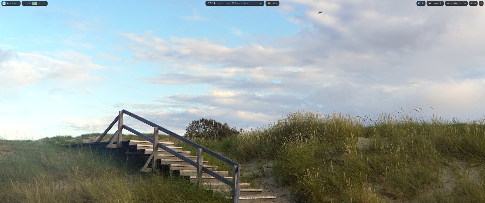
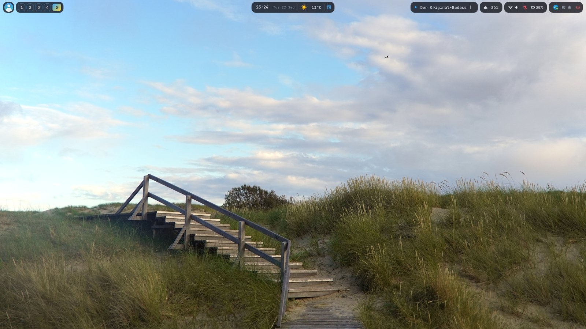
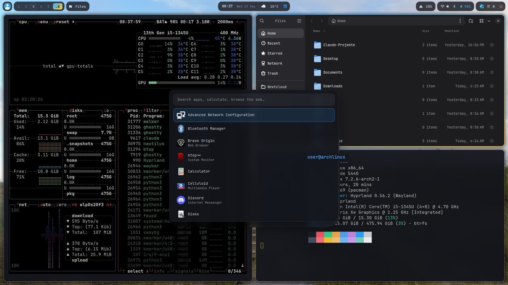
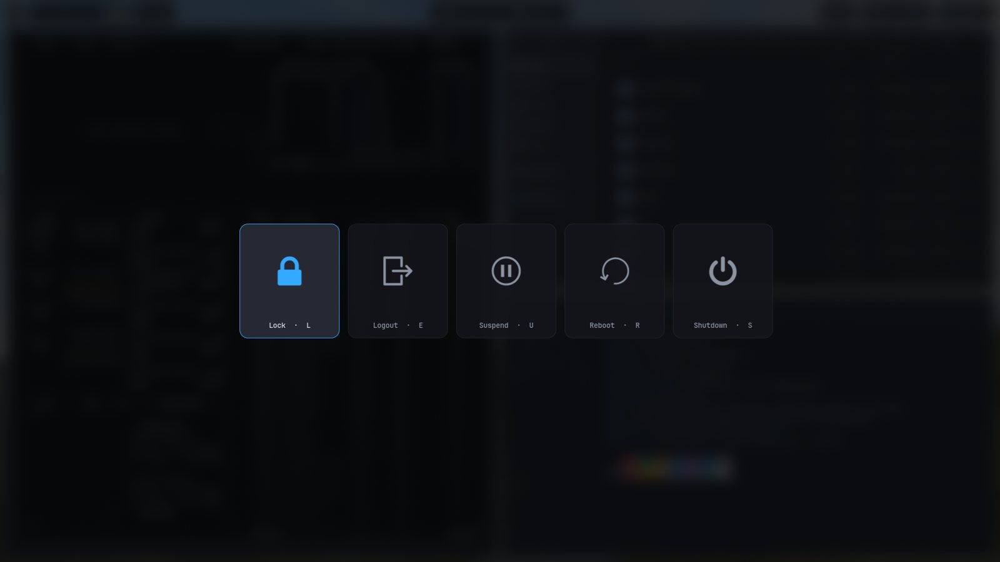
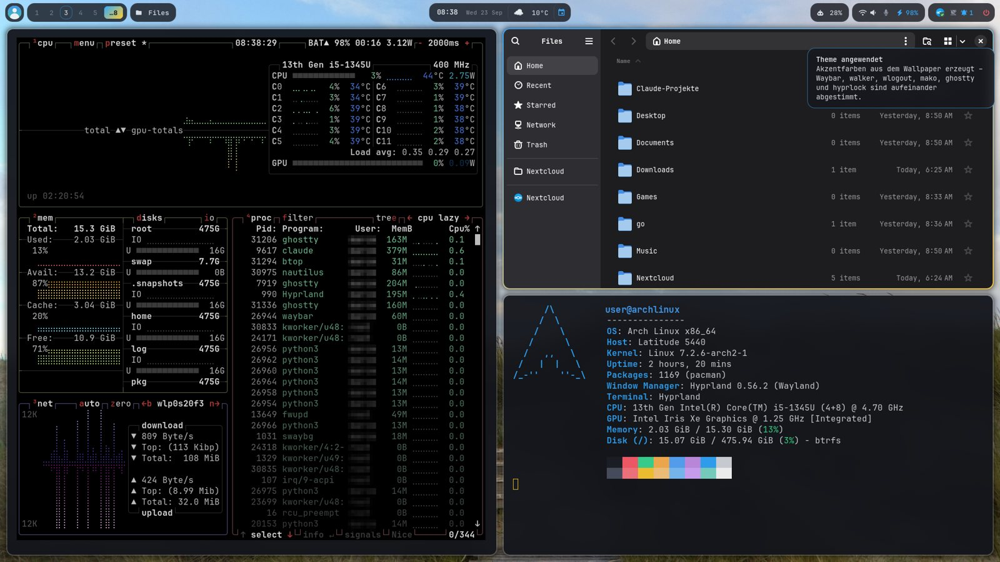
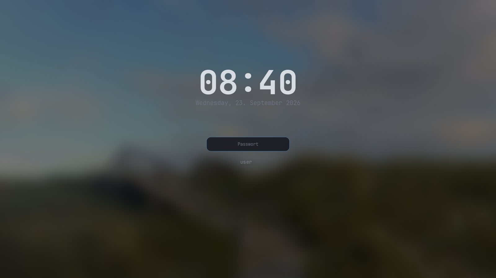
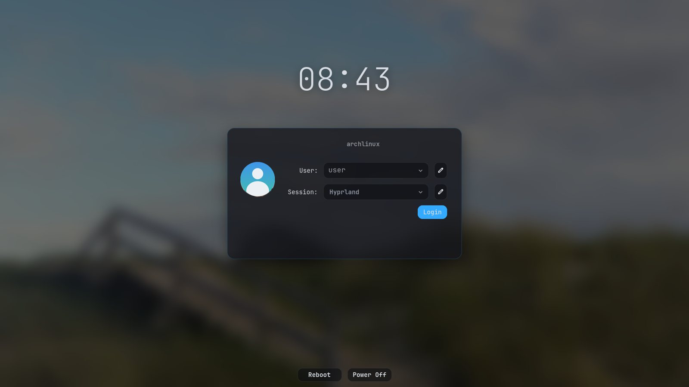

# driftless

[](../../actions/workflows/ci.yml)

One Arch Linux + Hyprland setup on all your machines, and they don't drift apart.

The repository is the only truth. Your home is made of symlinks into it, so editing
`~/.config/hypr/hyprland.lua` *is* editing the repository. An hourly sync commits what you changed,
takes over what your other machines changed (only if one of your machines signed it), and pushes.
A new machine gets everything from two scripts.

<table>
<tr>
<td width="50%"><br><sub>Desktop, 3440x1440 ultrawide.</sub></td>
<td width="50%"><br><sub>Notebook: the same setup with the compact bar.</sub></td>
</tr>
</table>

> [!WARNING]
> **A personal hobby project.** In daily use on two machines (a desktop and a notebook) and tested in a
> VM, not more. Most of the code and this README were written with an AI assistant (Claude).
>
> - Read the scripts first. `install-base.sh` wipes a disk, and the sync changes files in your home.
> - Try it in a VM before real hardware.
> - Keep your own backup. Git history and btrfs snapshots are not a backup of your data.
> - Keep the sync in *review first* (the default) until you trust it.

> **Coming from arch-hyprland-kit v1?** This is its successor, rebuilt around links instead of
> copies ([why](ARCHITECTURE.md)). See [moving over](#moving-over-from-arch-hyprland-kit-v1).

## What you get

- **Hyprland session under uwsm**: Waybar, mako, hypridle, the polkit agent, the clipboard history
  and the wallpaper run as systemd user units, so they restart when they crash
- **Theme from the wallpaper**: `set-wallpaper IMAGE` derives two accent colours and renders them
  into Waybar, walker, wlogout, mako, Ghostty, hyprlock, the login screen, GTK and Qt
- **One bar per monitor**: compact on notebook panels, spacious everywhere else, with no watcher process
- **Settings menu** on the avatar: widgets (per machine), wallpaper, monitors, sync
- **Gaming stack**: Steam, Proton-GE, Lutris, gamescope, gamemode, tearing for games
- **Login screen**: ReGreet in cage, with your wallpaper, colours and avatar
- **Base system**: btrfs with snapper, optional LUKS2 encryption, unified kernel images,
  zram, SMART warnings on the desktop, firewall

<table>
<tr>
<td width="50%"><br><sub>Tiling; the terminal palette follows the wallpaper.</sub></td>
<td width="50%"><br><sub>walker (<code>SUPER + SPACE</code>): apps, calculator, web search.</sub></td>
</tr>
<tr>
<td><br><sub>wlogout (<code>SUPER + SHIFT + M</code>).</sub></td>
<td><br><sub>mako; the bell pill counts and toggles do-not-disturb.</sub></td>
</tr>
<tr>
<td><br><sub>hyprlock.</sub></td>
<td><br><sub>ReGreet, with the wallpaper, avatar and hostname.</sub></td>
</tr>
</table>

## How it compares

| Tool | Probably the better choice if you … |
|---|---|
| NixOS + home-manager | want a fully declarative, reproducible system with rollbacks, and don't mind switching distro and learning Nix. |
| chezmoi, yadm, stow | mainly want your dotfiles on several machines. driftless links like stow does, and adds packages, system files, an installer and the sync. |
| aconfmgr | want your Arch system state tracked in Git, including saving the current state into the config. |
| Omarchy, HyDE, ML4W, end-4/dots | want a ready-made Hyprland desktop that more people maintain and use. |

driftless sits in between: the dotfiles are edited live (they are links), the packages and system
files are declared in lists and a package, and `driftless verify` shows where a machine differs.

## How it is built

| Path | What it is |
|---|---|
| `manifest` | What a machine gets: `link`, `group` (packages), `unit`, `user-unit`, each optionally `if=FACT` |
| `home/` | The dotfiles. Whole folders are linked (`~/.config/hypr` → `home/.config/hypr`) |
| `packages/*.list` | Package groups you write by hand. `aur:` marks AUR packages |
| `hosts/<hostname>/` | Per machine: `hyprland.lua`, `waybar.json`, `env`, a `manifest` with extra lines |
| `personal/` | Your layer: manifest, config (weather, mirrors, ...), private dotfiles. Never published |
| `system/` | The `driftless-system` package: every system file as a drop-in (sysctl.d, service.d, conf.d ...) |
| `dconf.ini` | The GNOME/GTK settings every machine gets |
| `lib/`, `driftless` | The `driftless` command |
| `install/` | `install-base.sh` (live ISO), `bootstrap.sh` (first boot), moving over from v1, switching to UKIs |

Facts come from the hardware (`driftless facts`): `cpu-amd`, `cpu-intel`, `gpu-amd`, `gpu-intel`,
`gpu-nvidia`, `hybrid`, `laptop`, `surface`, `marvell`, `vm`, plus `host:NAME`. The manifest picks
package groups with them, e.g. `group hw-gpu-nvidia if=gpu-nvidia`.

What stays on each machine and is never in the repository: the wallpaper and everything rendered
from it, the Waybar widget layout (`~/.local/state/waybar`), the monitor layout
(`~/.local/state/hypr`), the sync mode and the list of trusted machines (`~/.local/state/driftless`).

## Make it yours

1. Create your own **private** repository from this one ("Use this template" on GitHub, or clone and
   push to a new private repository). The sync pushes your dotfiles there.
2. Your personal layer: `cp -r examples/personal personal`, then fill in `personal/config` (weather
   location, mirror countries, install defaults) and `personal/hyprland.lua` (keyboard layout).
3. A folder per machine where it needs one: `cp -r hosts/example hosts/$(hostname)`, e.g. to pin a
   monitor's refresh rate.
4. The package lists in `packages/` are the author's choice: remove what you don't want, add yours.

## Install a new machine

1. Boot the Arch ISO (UEFI), connect, and get your repository onto it:
   ```bash
   pacman -Sy git
   git clone https://github.com/YOU/YOUR-REPO /root/driftless     # or: git clone FILE.bundle
   bash /root/driftless/install/install-base.sh --hostname NAME --encrypt
   ```
   It wipes the disk you pick. `--encrypt` puts everything into LUKS2; on a notebook, do it.
2. Reboot, log in, connect with `nmtui`, then:
   ```bash
   sudo bash ~/.local/share/driftless/install/bootstrap.sh     # --review-aur to read each PKGBUILD
   ```
3. Reboot. The login screen offers **Hyprland (uwsm-managed)**; that session starts the bar and the
   helpers.
4. On one of your other machines, the sync pill offers *Trust new machine*. Compare the fingerprint.

`driftless verify` checks at any time whether a machine is what the repository describes
(read-only, the exit code is the number of problems).

## Moving over from arch-hyprland-kit v1

v1 copied files between your home and the repository; driftless links them. On each machine, one
after the other:

1. `sudo snapper -c root create -d "before driftless"` and the same for `home`.
2. Put your driftless repository (made as in [Make it yours](#make-it-yours)) at
   `~/.local/share/driftless`, then look at what would happen:
   `bash ~/.local/share/driftless/install/migrate-from-rebuild.sh --dry-run`
3. Run it without `--dry-run` in your Hyprland session, then
   `sudo bash ~/.local/share/driftless/install/migrate-system.sh`, reboot and `driftless verify`.

The dotfiles come from driftless; your v1 versions are kept in `~/.local/state/driftless/backup/`.
**If you changed v1's dotfiles, carry those changes over by hand** (or list files that should keep
the machine's version in `MIGRATE_ADOPT`, `personal/config`). The old sync is switched off, the old
repository is left alone.

## Every day

```bash
driftless status                   # links, packages, sync in short
driftless sync --now               # sync right away (the timer runs hourly)
driftless packages                 # missing packages, and installed ones in no list
driftless packages add NAME GROUP  # keep a package on every machine
driftless mode review|auto|off     # review (default): changes from GitHub wait for you
set-wallpaper ~/Pictures/x.jpg     # wallpaper and colours, on this machine only
```

The Waybar sync pill shows the same: incoming (`↓n`) and outgoing (`↑n`) changes, who changed what,
and a menu for everything above.

### What the sync does and doesn't do

- It commits changes to files that are **already in the repository**. A new file only goes in when
  you `git add` it. A change that looks like a password or token stops the sync before the commit.
- It only takes over commits **signed by one of your machines** (SSH keys, `lib/signing.sh`). A stolen
  GitHub token can push, but nothing it pushes reaches your machines.
- It never merges on its own: if two machines changed the same lines, it stops and names the files.
  Your commits go on top of GitHub's, so the history stays linear.
- Packages from the lists are installed after a **password dialog**, never silently. AUR packages
  are only built in a terminal you open (`driftless packages install`), with the PKGBUILD diff shown.
- It never uninstalls anything, and it never upgrades the system.
- Programs that save by replacing a file (instead of writing into it) break a link. The sync notices,
  takes the new content into the repository and restores the link.

## Publishing a template

`driftless publish ../public-clone --push` exports everything except `personal/`, `signers/` and
`hosts/*` (but `hosts/example`). As a last guard, every exported file is searched for the terms in
`personal/forbidden`; one hit aborts the export.

## Checks

```bash
tests/lint.sh   # shellcheck, shfmt, ruff, and every script with a shebang must be executable
bats tests/     # links, manifest, packages, hardware facts, the sync between two machines, publish
```

The sync tests run the real `driftless` on two machines with their own home and a bare repository
as GitHub, with real SSH signatures. `pacman`, `systemctl` and the desktop tools are stubs.

## Tested hardware

| Machine | Status |
|---|---|
| Desktop PC (AMD CPU and GPU) | in daily use |
| Notebook (Intel) | in daily use |
| QEMU/KVM VM | fresh install with LUKS and UKI; moving over from v1 |
| Surface Pro 5, Dell Latitude (Intel) | worked with v1; untested with driftless |
| NVIDIA desktop, hybrid notebook | untested |

## More

- [ARCHITECTURE.md](ARCHITECTURE.md): the design, and what it replaced
- [CHANGELOG.md](CHANGELOG.md)
- [docs/boot.md](docs/boot.md): unified kernel images, and moving an existing machine to them
- [docs/encryption.md](docs/encryption.md): LUKS2 and unlocking with the TPM
