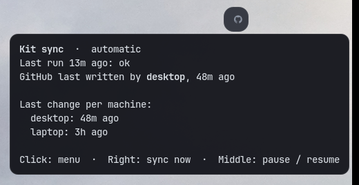
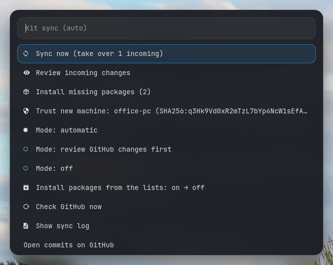
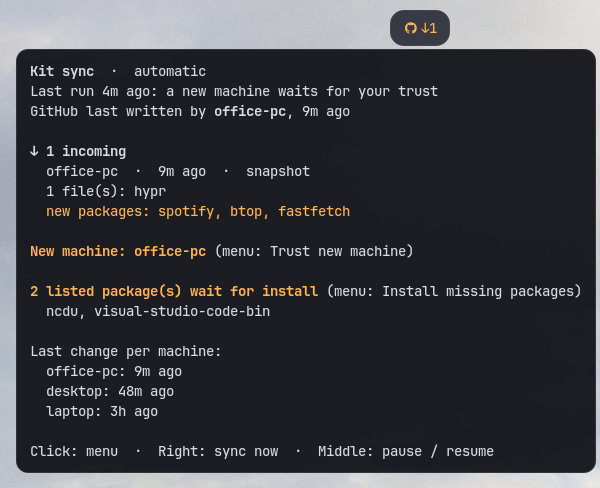
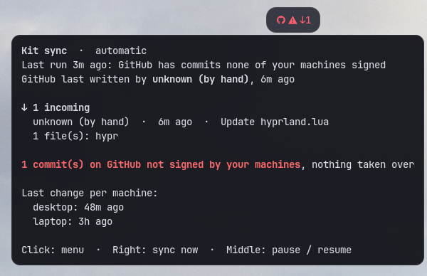

# arch-hyprland-kit

My Arch Linux and Hyprland setup, packaged so that a new machine can be installed with two scripts and several machines stay in sync through a private Git repository.

<table>
<tr>
<td width="50%"><br><sub>Desktop, 3440x1440 ultrawide.</sub></td>
<td width="50%"><br><sub>Notebook, 1920x1080: the same setup with a compact bar (<a href="#waybar-adapts-to-the-screen">how</a>).</sub></td>
</tr>
</table>

> [!NOTE]
> This is a personal hobby project. I use it daily on two machines and have tested it on a few more ([tested hardware](#tested-hardware)). Most of the code and this README were written with an AI assistant (Claude). Please read the scripts before running them: `install-base.sh` wipes a disk, and the sync changes files in your home directory every hour.

## What it is

- **An installer.** `install-base.sh` sets up a minimal Arch system from the live ISO (btrfs with snapper, systemd-boot). `restore.sh` then installs the packages, dotfiles, login screen and hardware-specific drivers on top.
- **A sync between machines.** A user timer records what changed on a machine (dotfiles, installed packages, VS Code extensions) and commits it to your repository. The other machines show the incoming changes and apply them when you confirm.
- **A desktop.** Hyprland, Waybar, walker, mako, hyprlock and ReGreet, themed with colours taken from the wallpaper.

## How it compares

None of this is new, and for many people one of these tools is the better choice:

| Tool | Probably the better choice if you … |
|---|---|
| NixOS + home-manager | want a fully declarative, reproducible system with rollbacks, and don't mind switching distro and learning Nix. |
| chezmoi, yadm, stow | mainly want your dotfiles on several machines. chezmoi also covers per-machine differences and can install packages via scripts. |
| aconfmgr | want your Arch system state (packages, files in `/etc`) tracked in Git, including saving the current state into the config. |
| Omarchy, HyDE, ML4W, end-4/dots | want a ready-made Hyprland desktop that more people maintain and use. |

The difference here is the direction: nothing is declared up front. You change a machine the usual way (`pacman -S`, editing a config, installing an extension), and the sync records it and offers it to your other machines. That is convenient, but less rigorous than Nix: nothing guarantees that two machines end up identical. `verify.sh` checks the obvious parts.

## What the sync does and doesn't do

- By default, a machine only shows incoming changes (an icon in Waybar) until you apply them. There is also an automatic mode.
- If two machines changed the same lines, it stops and lists the files. You merge by hand.
- Before it replaces or deletes a file, it copies it to `~/.local/state/rebuild/backup/` (the last 10 runs are kept).
- It never uninstalls or upgrades packages. Installing a package from the shared list asks for your password every time (polkit), and AUR packages are only built in a terminal you open.
- It only applies commits signed by one of your machines' SSH keys, so a leaked GitHub token alone cannot push files onto them.
- Files in `/etc` are recorded but never applied automatically.

Details: [automatic sync between machines](#automatic-sync-between-machines).

## Known limitations

- `install-base.sh`: UEFI, a single disk, systemd-boot, no disk encryption.
- Tested with AMD and Intel graphics. The NVIDIA code path exists but is untested.
- The kit has to live in `~/rebuild`.
- It ships one person's app selection: a gaming stack (Steam, Lutris), a Waybar widget for Claude usage limits (`waybar/claude-usage.py`, which uses an unofficial endpoint) and a Nextcloud calendar. Remove what you don't need from `packages/*.txt` and `waybar/config.jsonc`.
- No automated tests yet.

## Make it yours

This repository is a template. Your machines push their state to their repository every hour, so they need their own, and it should be private (it will hold your configs and package lists).

1. On GitHub: *Use this template → Create a new repository → Private*.
2. Clone it to `~/rebuild` on your first machine.
3. Adjust what is personal, before or after the first install:

| What | Where |
|---|---|
| Keyboard layout | `kb_layout` in `files/home/.config/hypr/hyprland.lua`; console: `install-base.sh --keymap` |
| Timezone, hostname, user | `install-base.sh --tz … --hostname … [user]` |
| Wallpaper and colours | `set-wallpaper /path/to/image` (the theme follows) |
| Weather location | from your IP; to fix it, set `WTTR_LOCATION` in the environment |
| Name in the bar | your account's full name (`sudo chfn -f "Your Name" $USER`) |
| Avatar | `files/home/.config/waybar/avatar.png`, `files/etc/greetd/avatar.png` |
| Programs | `packages/pacman.txt`, `packages/aur.txt` (or install/uninstall as usual; the sync records it) |
| Calendar (optional) | `bash calendar-login.sh` asks for your Nextcloud address and login |
| Notes folder (optional) | `KIT_NOTES_REL` in `kit.conf` |

Then install as described in [Quick start](#quick-start). On every further machine, clone the same repository and run `restore.sh`.

## Contents
- [Changelog](CHANGELOG.md)
- [Theme gallery](#theme-gallery)
- [Quick start](#quick-start)
- [Automatic sync between machines](#automatic-sync-between-machines)
- [Waybar adapts to the screen](#waybar-adapts-to-the-screen)
- [Display modes (SUPER + SHIFT + P)](#display-modes-super--shift--p)
- [Hardware detection](#hardware-detection-libhardwaresh)
- [What's in the kit](#whats-in-the-kit)
- [What `restore.sh` also creates](#what-restoresh-also-creates)
- [Not in the kit](#not-in-the-kit)
- [Tested hardware](#tested-hardware)

## Theme gallery

`theme/apply.py` derives two accent colours from the wallpaper and renders them into Waybar, walker, wlogout, mako, Ghostty, hyprlock, ReGreet, GTK 3/4, Qt and the Hyprland borders. Everything uses the same dark, translucent surface with rounded corners and JetBrainsMono Nerd Font. All screenshots are from the 1920x1080 notebook.

<table>
<tr>
<td width="50%"><br><sub>Tiling: btop, Nautilus and Ghostty with fastfetch. The terminal palette follows the wallpaper.</sub></td>
<td width="50%"><br><sub>walker (<code>SUPER + SPACE</code>): apps, calculator and web search. Also the menu for clipboard history, emoji and display modes.</sub></td>
</tr>
<tr>
<td><br><sub>wlogout (<code>SUPER + SHIFT + M</code> or the power pill).</sub></td>
<td><br><sub>mako notifications. The bell pill counts them and toggles do-not-disturb.</sub></td>
</tr>
<tr>
<td><br><sub>hyprlock, via hypridle or the lock tile.</sub></td>
<td><br><sub>ReGreet in cage, with the wallpaper, avatar and hostname.</sub></td>
</tr>
</table>

## Quick start

1. **Fresh install only, this wipes the disk.** Boot the Arch live ISO, clone your kit repository (`git clone https://github.com/<you>/<repo> /root/rebuild`; for a private repository, a personal access token is the password) and run the base install from the clone:
   ```bash
   bash install-base.sh [/dev/DISK] [user] [--hostname NAME] [--keymap MAP] [--tz ZONE]
   ```
   It creates GPT with an ESP and one btrfs partition (subvolumes `@`, `@home`, `@log`, `@pkg`, `@snapshots`), installs systemd-boot and the matching CPU microcode, and creates the user. Without a disk argument it lists the disks and asks. Use a clone, not an unpacked zip: the sync needs the `.git` folder.
2. Reboot, log in as your user, connect to the network (`nmtui`), then restore the kit. It is safe to run more than once.
   ```bash
   sudo bash ~/rebuild/restore.sh    # options: --no-aur, --review-aur, --no-snapshot, -u USER
   ```
   It asks for your password a second time right at the start: AUR packages are built as your user and installed with your sudo, and it keeps that ticket valid until the AUR step is done (no sudoers rule). By default the AUR packages from `packages/aur.txt` are built without showing their PKGBUILDs; with `--review-aur`, yay shows each one and asks before building. An already active `ufw` firewall keeps its rules.
3. Reboot. ReGreet starts, and Hyprland after login.
4. Optional: set up the calendar. The Nextcloud app password goes into the keyring, not into the kit.
   ```bash
   bash ~/rebuild/calendar-login.sh
   ```

At the end, `restore.sh` runs `verify.sh`, a read-only check of whether the system matches the kit (home ownership, packages, dotfiles, `/etc`, services, boot entries). Its exit code is the number of failed checks. You can run it on its own at any time:

```bash
bash ~/rebuild/verify.sh
```

An already installed machine joins the sync with the repository cloned to `~/rebuild`. It first takes over the GitHub state as a whole, then installs the package installer the sync uses (which asks for your password every time):

```bash
cd ~/rebuild && git fetch && git reset --hard origin/main && ./auto-snapshot.sh --adopt
sudo install -Dm755 files/usr/local/bin/rebuild-install /usr/local/bin/rebuild-install
sudo install -Dm644 files/usr/share/polkit-1/actions/org.rebuild.install.policy /usr/share/polkit-1/actions/org.rebuild.install.policy
bash lib/signing.sh setup
systemctl --user enable --now rebuild-snapshot.timer
```

## Automatic sync between machines

Every machine runs the same user timer, `rebuild-snapshot.timer`: 3 minutes after login, then hourly. Each run of `auto-snapshot.sh` has four steps. In the default mode, *review first*, it stops after fetching while GitHub has something new (see [modes](#sync-pill-in-the-bar)).

1. Snapshot: `snapshot.sh` records this machine's changes in the kit (dotfiles, dconf, notes, package lists, VS Code extensions, readable `/etc` files) and commits them as `Automatic snapshot <host> <time>`.
2. Pull: it merges `origin/main`. If both machines changed the same lines, nothing is applied or pushed; the pill turns red and names the files, and you merge by hand (`git merge origin/main` in the kit). The package lists are the exception: git keeps both sides' lines there (`merge=union` in `.gitattributes`).
3. Apply: it copies every kit file the merge changed onto this machine (`files/home` → `~`, `files/dconf.ini` → `dconf load`, `files/CLAUDE.md` and `files/docs` → the notes folder set in `kit.conf`) and deletes files that were deleted in the kit. Each live file it replaces or deletes is copied to `~/.local/state/rebuild/backup/<time>/` first. Hyprland, Waybar, mako and systemd are reloaded as needed, and missing packages and VS Code extensions from the lists are installed.
4. Push, then refresh the zip copy (`KIT_ZIP` in `kit.conf`) if the kit changed.

The details:

- Package lists are shared. A machine only adds what it installed and drops what it removed since its own last snapshot (`lib/lists.sh`, state in `~/.local/state/rebuild`). A package that only one machine has therefore ends up on all of them. The sync never uninstalls: a package removed on one machine leaves the list, and the others keep it until you remove it there too. Hardware packages (microcode, GPU drivers, notebook extras) stay out of the lists (`lib/hardware.sh`).
- Deletions work the same way. A file missing on one machine only counts as deleted if that machine had it at its last snapshot (or got it from the sync since). A machine that never had a file does not delete it everywhere else (`guard_deletions` in `lib/lists.sh`).
- Window sizes stay per machine: `files/dconf.ini` leaves out window geometry (`filter_dconf` in `lib/lists.sh`), which differs per screen and only caused noise and merge conflicts.
- Installing asks for your password, every time. Missing packages from the official repositories come up in a polkit dialog that names them (`pkexec rebuild-install`, a small root-owned script that only accepts package names and only runs `pacman -S --needed`). The dialog comes once per new set of missing packages. If you cancel it or leave it for 5 minutes, the packages wait in the [sync pill](#sync-pill-in-the-bar) until you pick *Install missing packages* (or *Sync now*, which asks again).
- AUR packages are never built unattended, since a PKGBUILD is a script that runs on your machine. They wait in the pill, and *Install missing packages* opens a terminal with `yay`, which shows each PKGBUILD diff before building.
- The sync does not upgrade the system. If a package cannot be installed (for example because the package database is outdated), you get one notification; run `sudo pacman -Syu`.
- Nothing runs as root without your password, even after a push to the kit repository. What the sync does take over without asking in automatic mode are your dotfiles, and those can run code as your user (Hyprland `exec`, systemd user units, shell configs). That is why every commit must be signed by one of your machines:
  - Every machine signs its commits with its own SSH key (`~/.ssh/rebuild-signing`) and publishes the public half as `signers/<host>.pub`. Before merging, the sync checks every incoming commit against `~/.local/state/rebuild/allowed_signers`, a list that only exists on the machine and never travels with the kit (`lib/signing.sh`). A stolen GitHub token, a hijacked browser login or an edit in GitHub's web editor can still push, but nothing it pushes is taken over: the pill turns red and you get one notification. A compromised machine of yours is not covered, since its key signs.
  - Set up once per machine that is already running (`restore.sh` does it on new installs): `bash ~/rebuild/lib/signing.sh setup`. It takes over the current GitHub state one last time without a check, then pushes the machine's key.
  - A new machine signs with a key the others don't know yet. They hold its commits back, and the pill offers *Trust new machine: host (fingerprint)*. That opens a terminal: compare the fingerprint with `ssh-keygen -lf ~/.ssh/rebuild-signing.pub` on the new machine and type `yes`. A key that claims the name of a machine you already trust is never offered.
  - A reinstalled machine has a new key. Remove its old line on every other machine first (`sed -i '/^HOST /d' ~/.local/state/rebuild/allowed_signers`), then trust it as a new one.
  - Foreign commits on GitHub block the sync until they are gone. Look at them (*Review incoming changes*), change your GitHub credentials, then drop them from a trusted machine: `git push --force-with-lease=main:origin/main origin HEAD:main`.
  - Keep the repository private, use 2FA, and give nobody else write access.
- `/etc` files are recorded, not applied (that would need root). A machine only writes one into the kit when the file changed there, so an older copy never overwrites a newer one. `/etc/hostname` differs per machine; the kit keeps its copy only as a fallback name for `restore.sh`.
- A machine that fell behind (for example, switched off for weeks) should take over the GitHub state as a whole first. Otherwise its first snapshot would push its old files back:
  ```bash
  ~/rebuild/auto-snapshot.sh --adopt
  ```
  This drops unpushed local commits and copies every kit file over the live one.

To run the sync by hand, for example right after a bigger config change, and read its log:

```bash
systemctl --user start rebuild-snapshot.service
journalctl --user -u rebuild-snapshot.service -n 30
```

### Sync pill in the bar

The sync shares a pill with the package updates (`group/upkeep`; in the compact bar it sits in the system group). It shows the GitHub logo. It is dim when everything is in step, shows `↓n` for commits on GitHub this machine has not taken over and `↑n` for local commits not pushed yet, turns yellow while something waits for review or the sync is off, and red after a merge conflict or a failed run. The tooltip says who wrote to GitHub last, what the incoming commits would change (files, and new packages highlighted) and when each machine last sent a change.

<table>
<tr>
<td width="50%"><br><sub>All in step: last run, who wrote to GitHub last, and when each machine last sent a change.</sub></td>
<td width="50%"><br><sub>The menu (click): sync now, review the incoming diff, install waiting packages, trust a new machine, modes.</sub></td>
</tr>
<tr>
<td><br><sub>Yellow: a new machine signed its first commit and waits for your trust; two listed packages wait for your password.</sub></td>
<td><br><sub>Red: someone pushed a commit none of your machines signed (here: an edit in the web editor). Nothing is taken over.</sub></td>
</tr>
</table>

| Mode | What the hourly run does |
|---|---|
| review first (default) | records and fetches, but while GitHub has something new it stops before the merge: nothing applied, nothing pushed, one notification. Look at the diff, then *Sync now* takes it over. |
| automatic | all four steps every run |
| off | nothing |

Separately, *installs off* keeps the sync from installing any package or VS Code extension from the lists (configs are still applied). Click the pill for the menu (modes, installs, *Review incoming changes* as a full diff in a terminal, *Check GitHub now*, log, commits on GitHub); right-click syncs now, middle-click pauses or resumes in the previous mode. From a terminal: `~/.config/waybar/sync-menu.sh now|toggle|auto|review|off|installs|install|trust FINGERPRINT|check|diff|log|github`.

The switches are files in `~/.local/state/rebuild` (`mode`, `installs`) and never travel with the kit, so nothing pushed to GitHub can switch them. Every run writes its outcome to `status` there and refreshes the pill (signal 11). `sync.py` only reads local git refs; the network is used by the run or by *Check GitHub now*.

## Waybar adapts to the screen

The bar was designed for a 3440px monitor. On a 1920px notebook panel the same pills would be too crowded, so every monitor gets its own bar in the layout that fits its width. A notebook docked to an ultrawide shows the compact bar on its panel and the spacious one on the big screen, and follows plugging, unplugging and display mode changes.

| Monitor width (logical px) | Layout of that monitor's bar |
|---|---|
| ≥ 2560 | spacious: `config.jsonc` + `style.css` as written |
| < 2560 | compact: `config-compact.jsonc` merged over `config.jsonc`, `style-compact.css` on top of `style.css` |

In the compact layout, the avatar has no name next to it, the window pill shows only the app, clock, weather and calendar share one pill in the middle, Claude usage shows only the limit that runs out first, and network/volume/mic/battery and tray/updates/notifications/power are grouped into one pill each. Numbers and full texts stay in the tooltips.

How it works (all in `files/home/.config/waybar/`):
- `density-watch.py` runs from the Hyprland autostart, follows Hyprland's monitor events and renders the effective `config.jsonc` (one bar per active monitor, pinned via `output`) and `style.css` into `~/.cache/waybar/`. Disabled and mirrored monitors get no bar. When the layout changes it restarts Waybar; style-only edits are picked up by Waybar itself. `SIGUSR1` forces a re-render (used by `display-mode.sh`, since mirroring fires no monitor event).
- Compact bars are named `compact`, and every rule of `style-compact.css` is scoped to `window#waybar.compact` when rendered, so compact styling never leaks onto a spacious bar. Write it as plain selectors.
- `launch.sh` renders once and starts Waybar from the cache. Always start Waybar through it (autostart and `set-wallpaper` do).
- The overlay merges objects key by key and replaces lists; modules without a definition (e.g. `battery` on a desktop) are dropped. `window.py`, `media.py`, `calendar.sh` and `claude-usage.py` take a `compact` argument.
- Edit the sources in `~/.config/waybar/`, not the generated files in `~/.cache/waybar/`.

## Display modes (SUPER + SHIFT + P)

`SUPER + SHIFT + P` (or the notebook's display key) opens a walker menu with Extend, Mirror, Laptop only and External only. From a terminal: `~/.config/hypr/display-mode.sh extend|mirror|internal|external`.

- The panel is `eDP-1`; the external monitor is the first other connected output. Extend puts it to the right, Mirror shows the panel's content on it.
- The mode is applied at runtime via `hyprctl eval` and lasts until the next config reload; after that Hyprland is back to extend.
- If the last active monitor goes away (external unplugged in "external only" mode), `hyprland.lua` switches the panel back on.
- Waybar follows every mode change.

## Hardware detection (`lib/hardware.sh`)

`install-base.sh` and `restore.sh` read CPU, GPU and chassis from `/proc` and sysfs (no `lspci` needed) and pick the matching hardware packages per machine. These packages never end up in `packages/pacman.txt`; `snapshot.sh` filters them out via `HW_PKG_REGEX`.

| Component | Detection → result |
|---|---|
| CPU | `amd-ucode` / `intel-ucode` (none in VMs) |
| GPU | AMD: `vulkan-radeon` (+lib32). Intel: `vulkan-intel` (+lib32, `intel-media-driver`). NVIDIA: `nvidia-open-dkms` (+utils, lib32, headers for `linux`/`linux-lts`; Turing/RTX 20 and newer). Hybrid: additionally `nvidia-prime`. Early-KMS modules in `/etc/mkinitcpio.conf.d/10-gpu.conf`, `nvidia-drm.modeset=1` on the boot entry. |
| Notebook | (chassis type or battery) `power-profiles-daemon`, `upower`, `brightnessctl`, `sof-firmware`, Waybar battery pill (`laptop/`). Brightness keys and touchpad scrolling are in `hyprland.lua`. |
| Monitor | `hyprland.lua` lets Hyprland pick mode and position for every monitor (`preferred`/`auto`). Pin a monitor's mode with an extra rule matched by its description (`output = "desc:…"`, see `hyprctl monitors`), so it never catches any other monitor. The login image is cropped to the real screen size the next time `set-wallpaper --current` runs inside Hyprland. |
| Hostname | `restore.sh` keeps the name `install-base.sh` set. |
| Surface | (DMI `Microsoft Corporation`/`Surface*`) step 4c installs `linux-surface` and `iptsd` from `pkg.surfacelinux.com` (key in `laptop/`, fingerprint checked) and creates `arch-surface.conf`. The Marvell WiFi firmware is already in the base install. |

Stays as configured (not hardware-detected): Hyprland keyboard layout, weather location, app selection.

## What's in the kit

| Path | Contents |
|---|---|
| `packages/{pacman,aur,vscode-extensions}.txt` | Package lists shared by all machines (explicitly installed only, no hardware packages) |
| `files/etc/` | System configs: greetd with ReGreet config/CSS and avatar, PAM, sysctl, zram, reflector, NetworkManager, locale, hostname, `smartd.conf`, coredump limit |
| `files/home/` | Dotfiles: Hyprland, Waybar, wlogout, mako, walker, Ghostty, qt6ct, GTK, starship, wallpaper, launchers |
| `files/usr/` | Login background for ReGreet, `smartd-notify` (SMART warnings as mako notifications) and the sync's package installer |
| `kit.conf` | Personal settings, e.g. an optional notes folder (`KIT_NOTES_REL`) synced as `files/CLAUDE.md` + `files/docs/` |
| `files/dconf.ini` | GNOME/GTK settings (`dconf dump /` without window geometry): theme, cursor, font, app settings |
| `calendar-login.sh` | Sets up the Nextcloud calendar (vdirsyncer/khal) |
| `cfg-backup` | `cfg-backup FILE...` copies each file to `FILE.bak-YYYYMMDD-HHMMSS` |
| `verify.sh` | Read-only check of whether the system matches the kit |
| `auto-snapshot.sh` | The sync (timer `rebuild-snapshot.timer`): record, pull, apply, push |
| `snapshot.sh`, `lib/lists.sh` | Record this machine's state in the kit; merge rules for shared lists and files |
| `lib/signing.sh`, `signers/` | Signed kit commits: each machine's key, trust for new machines, the check before every merge |
| `files/usr/local/bin/rebuild-install`, `files/usr/share/polkit-1/actions/org.rebuild.install.policy` | How the sync installs listed packages: `pkexec rebuild-install PACKAGE…`, a password dialog every time, package names only |

## What `restore.sh` also creates

Generated at runtime rather than shipped as files:
- snapper config `home` (same retention as `root`)
- systemd-boot entry `arch-lts.conf`, derived from `arch.conf`, if `linux-lts` is installed
- firewall `ufw` (deny incoming, allow outgoing), unless it is already enabled
- enables `smartd` and `fwupd-refresh.timer`

## Not in the kit

Personal data, which you back up yourself:
- Steam library
- Lutris prefixes
- Brave and Thunderbird profiles
- `~/.ssh`, keyrings, Nextcloud login, `~/.claude`

Snapper configs (`root`, `home`) are created on every rebuild (retention 5h/7d/2w/1m/0y). The ufw rules are the defaults, with no extra allowances.

## Tested hardware

| Machine | Status |
|---|---|
| Desktop PC (AMD) | works, in daily use |
| QEMU/KVM VM (no GPU path) | works |
| Surface Pro 5 (Intel, Marvell WiFi) | works |
| Dell Latitude (Intel) | works |
| NVIDIA desktop | untested |
| Hybrid notebook (NVIDIA + Intel/AMD) | untested |
