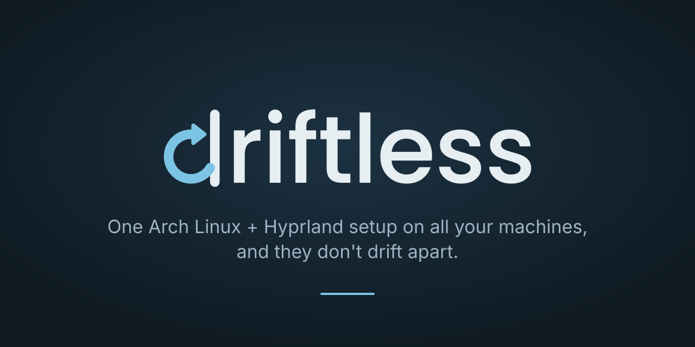

<a href="../../README.md"><picture><source media="(prefers-color-scheme: dark)" srcset="logo-on-dark.svg"></picture></a>

# Brand

The driftless mark is a **d** whose bowl is an arrow coming back to its stem: changes go out and
return to the one line that holds them, the repository. Everything here is SVG and may be used to
point to driftless, in articles, talks, forks and screenshots.

## The files

| | File | Use it for |
|---|---|---|
|  | [`wordmark-on-light.svg`](wordmark-on-light.svg) | The name, on light backgrounds |
|  | [`wordmark-on-dark.svg`](wordmark-on-dark.svg) | The name, on dark backgrounds (headers, the README) |
|  | [`logo-on-light.svg`](logo-on-light.svg) | The mark alone, on light backgrounds |
|  | [`logo-on-dark.svg`](logo-on-dark.svg) | The mark alone, on dark backgrounds |
|  | [`app-icon.svg`](app-icon.svg) | Where a square, filled icon is expected: avatars, launchers, favicons |
|  | [`social-preview.png`](social-preview.png) | The repository's social preview, 1280×640 (source: [`social-preview.svg`](social-preview.svg)) |

The wordmark is the first choice. The mark alone is for small spaces and for places where the name
already stands next to it.

## Colours

| | On dark | On light |
|---|---|---|
| Text, stem | `#e6eef2` | `#14212b` |
| Arrow (accent) | `#7cc4e4` | `#1f6f9c` |

The app icon puts the dark ink `#14212b` on the light accent `#7cc4e4`. The social preview sits on
a deep slate, `#0f1a22` to `#1c3242`.

## Using it

- **Space:** keep free space around the mark of at least the stroke's width doubled; around the
  wordmark, at least half its height.
- **Size:** the wordmark not below 96 px wide, the mark not below 16 px.
- **Pick the variant for the background.** On GitHub, switch with `<picture>` and
  `prefers-color-scheme`, as the README does; GitHub follows its own theme there.
- **Don't** recolour, stretch, rotate, outline or put a shadow behind it, and don't set the name in
  another typeface next to the mark. The letters are outlines, no font is needed.
